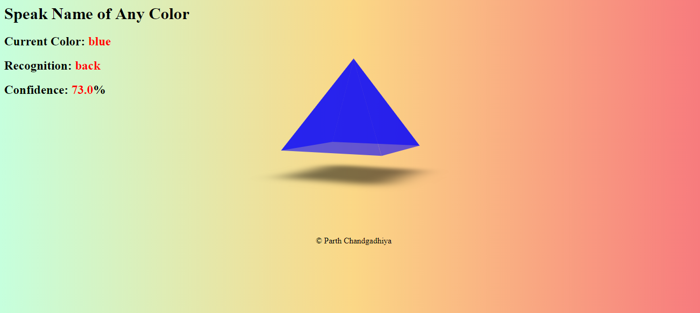

# Color-Changer

Color Changer is a JavaScript based project which can change color of 3D floating pyramid on the screen based upon user voice command. Model can also show the confidence level and what it is about to process on the web page.

## Initial Screen
 

## Output after uttering "Green"
 
pyramid changes to green.

## Recognition fails
 

## Blue Recognition success 
 

## Black Recognition success 
 
